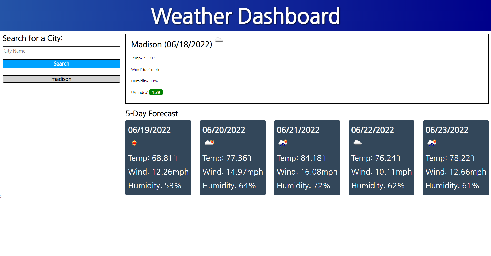

# Weather Dashboard

An app that helps you see the weather outlook for multiple cities so that you can plan a trip accordingly

## App details:

- A weather dashboard with form inputs
- When the user searchs for a city they are presented with current and future conditions for that city and that city is added to the search history
- When the user views current weather conditions for that city they are presented with the city name, the date, an icon representation of weather conditions, the temperature, the humidity, the wind speed, and the UV index
- When the user views the UV index they are presented with a color that indicates whether the conditions are favorable, moderate, or severe
- When the user views future weather conditions for that city they are presented with a 5-day forecast that displays the date, an icon representation of weather conditions, the temperature, the wind speed, and the humidity
- When the user click on a city in the search history they are again presented with current and future conditions for that city

### Site Link:

Click [HERE](https://woodb58.github.io/weather/)

### Layout:

